<!-- ============================================================
     Kawaii party-cat theme  ·  artwork lives in /assets
     edit & rebuild the SVGs with:  python tools/build_assets.py
     ============================================================ -->

 

<!-- ===================== ABOUT ===================== -->

  

<table align="center">
<tr>
<td width="55%" valign="middle">

### 🐾 Hello, World!

I'm **Paphop** — a **Full-Stack Developer** from **Thailand** 🇹🇭,
currently studying **Computer Science**.

- 🎮 &nbsp;I build **2D games** with **C#**
- 🌸 &nbsp;I craft modern **web apps** with **TypeScript & React**
- 📱 &nbsp;Web & mobile, front to back
- 🌱 &nbsp;Always learning something new
- 🍓 &nbsp;*Not a robot — just a human powered by strawberry milk*

</td>
<td width="45%" align="center" valign="middle">

</td>
</tr>
</table>

<!-- ===================== TECH STACK ===================== -->

  

<table>
<tr>
<td align="center" width="50%">

**🌸 Frontend**

**🍓 Backend**

</td>
<td align="center" width="50%">

**⭐ Database**

**🎀 Tools & DevOps**

</td>
</tr>
</table>

<!-- ===================== FUN FACTS ===================== -->

  

<table align="center">
<tr>
<td>

- 🍓 &nbsp;Strawberry milk is my main fuel
- 🎮 &nbsp;I started coding because I wanted to make my own games
- 🐱 &nbsp;I believe every app is better with a cat in it
- 🌙 &nbsp;My best ideas show up at 2 AM
- 🐛 &nbsp;I name my bugs before I squash them

</td>
</tr>
</table>

<!-- ===================== FOOTER ===================== -->

🍓 made with love, cats & strawberry milk 🥛

